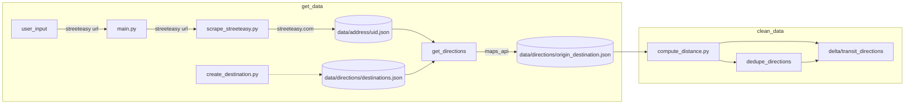

# homehuntr

A project to decide on apartment listings based on a set of criteria. Rankings are based on a weighted average of the criteria.

## Criteria

1. Price
2. Location (travel time to common destinations, grocery stores, etc.)
3. Amenities (laundry, dishwasher, etc.)

## Data Sources

### Google maps API

- Travel time by transportation type (train, bus, bike, walk)
- Nearby grocery stores and their ratings

### Streeteasy

Price and amenities

## ELT

# TODOS

- [ ] transition all writes to gcp
